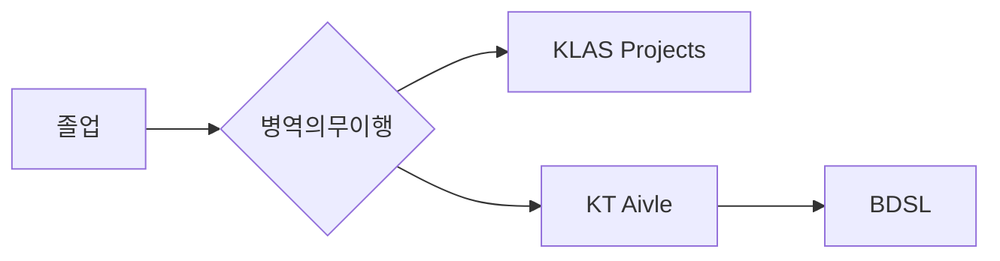

# 소개

안녕하세요. 백희선 입니다.

## Affiliation

- 연구실: [BDLS Lab](https://bdsl.jbnu.ac.kr/blog/)
- 분야: Metagenomics & Microbiome Analysis
- 자격증: KT AI Associate
- 강연: [전북대학교 식품연구센터 세미나](http://_ssp._domainkey.ctcf2.com/bbs/board.php?bo_table=com_article&wr_id=427&sst=wr_hit&sod=asc&sop=and&page=7&device=mobile)

## Research Interests
### Microbiome Analysis
- Amplicon Sequencing : 16S/ITS
- Metagenomics : Shotgun sequencing
- Preprocessing : 
	- nf-core/ampliseq ...
- Taxonomic Profiling :
	- nf-core/taxprofiler ( Kraken2/Bracken, MetaPhlAn4 (HRGM2) )
- Functional Profiling
	- PICRUSt2
	- HUMAnN3 ( ChocoPhlAn, Uniref90 )

### Statistics & Data Analysis
- Microbiome Diversity 
- PERMANOVA & PCOA
- Multivariate analysis

### AI - Machine/Deep Learnning
- BERT , DNABERT-2
- RandomForest
- LLM Integration : Ollama & Ollama WebUI , HuggingFace

### Reproducible Research
- Nextlfow
- Docker/Podman

### Data Collection
- Web Scraping : Selenium , HTML / Json parsing ...
- API : RESTful ...

### Infra
- Kubernetes , Singularity
- Linux Environments

## Technics
### Languages
#### Python
Primary language for data analysis and bioinformatics

- Data analysis : Pandas, Numpy , Scipy
- Visualization : Matplotlib, Seaborn
- Bioinfomatics : Biopython, Scikit-bio
- AI : scikit-learn, PyTorch, Tensorflow
#### C++
High-performance computing and algorithm implementation

- Algorithm optimization & Understand How to work : Prodigal, ... 

#### R
Statistical analysis and specialized bioinformatics packages

### Infra
- Kubernetes
- Docker / Podman
- AWS, GCP, Azure
- Linux OS

## TimeLine

| 기간          | 내용       |
| ----------- | -------- |
| 2025 ~ 현재   | BDSL lab |
| 2024 ~ 2025 | KT Aivle |
| 2022 ~ 2024 | 병역 의무 이행 |

## Contact
- GitHub: [@e4m-hash](https://github.com/e4m-hash)
- Email: `e4m98s@gmail.com`
