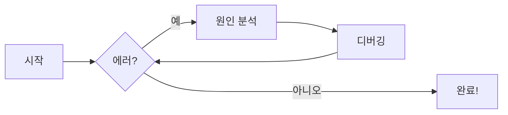
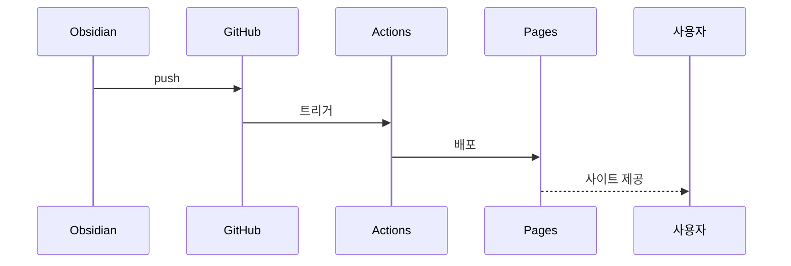

# Mermaid 다이어그램

코드 블록에 `mermaid` 언어를 지정하면 다이어그램으로 렌더링됩니다.
([Material 공식 문서](https://squidfunk.github.io/mkdocs-material/reference/diagrams/) 참고)

```mermaid
graph LR
  A[시작] --> B{에러?};
  B -->|예| C[원인 분석];
  C --> D[디버깅];
  D --> B;
  B ---->|아니오| E[완료!];
```

시퀀스 다이어그램도 지원합니다.

```mermaid
sequenceDiagram
  Obsidian->>GitHub: push
  GitHub->>Actions: 트리거
  Actions->>Pages: 배포
  Pages-->>사용자: 사이트 제공
```
