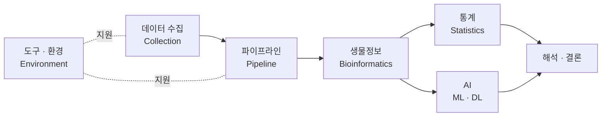

# Data Analysis

## 스택 계층

| 계층           | 폴더                                            | 다루는 것                     | 핵심 도구                                              |
| ------------ | --------------------------------------------- | ------------------------- | -------------------------------------------------- |
| 데이터 수집       | [`data-collection`](data-collection/index.md) | 웹 스크래핑 · API 수집 · 파싱      | Selenium, RESTful, HTML/JSON                       |
| 파이프라인 · 재현성  | [`pipeline`](pipeline/index.md)               | 워크플로 자동화 · 컨테이너 · 인프라     | Nextflow, nf-core, Docker/Podman, Singularity, K8s |
| 생물정보 (도메인)   | [`bioinformatics`](bioinformatics/index.md)   | 앰플리콘 · 메타지놈 · 분류/기능 프로파일링 | QIIME2, Kraken2/Bracken, MetaPhlAn4, HUMAnN3       |
| 통계 분석        | [`statistics`](statistics/index.md)           | 생물통계 이론 · 다변량 · 미생물군집 통계  | R, PERMANOVA, PCoA, 회귀                             |
| AI (ML · DL) | [`ai`](ai/index.md)                           | 머신러닝 · 딥러닝 · LLM · 논문 리뷰  | scikit-learn, PyTorch, DNABERT-2, Ollama, RAG      |
| 도구 · 환경      | [`environment`](environment/index.md)         | 작성 환경 · 문법 · 언어 메모        | Markdown, LaTeX, Mermaid, Python/R/C++             |

## 사용 언어

| 언어     | 용도                  | 주요 라이브러리                                                                                               |
| ------ | ------------------- | ------------------------------------------------------------------------------------------------------ |
| Python | 분석 · 생물정보 주력        | pandas, numpy, scipy / matplotlib, seaborn / biopython, scikit-bio / scikit-learn, PyTorch, TensorFlow |
| R      | 통계 분석 · 전용 생물정보 패키지 | SPIEC-EASI 등                                                                                           |
| C++    | 고성능 연산 · 알고리즘 구현    | Prodigal 등                                                                                             |
