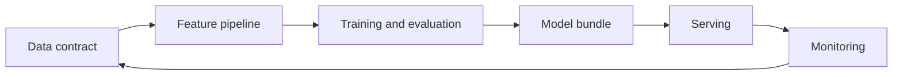

# Engineering Notes

ML 시스템을 구현하는 데 필요한 엔지니어링 기록입니다. 생물학 지식과 도구는
별도 [Domain / Bioinformatics](../domain/bioinformatics/index.md) 탭에서 관리합니다.

```mermaid
flowchart LR
  A[Data contract] --> B[Feature pipeline]
  B --> C[Training and evaluation]
  C --> D[Model bundle]
  D --> E[Serving]
  E --> F[Monitoring]
  F --> A
```

## 중심 경로

- [ML Engineering](ai/machine-learning/engineering/index.md) — 전체 lifecycle과 구현 기준
- [AI](ai/index.md) — 모델과 학습 방법
- [파이프라인](pipeline/index.md) — workflow와 재현성
- [데이터 수집](data-collection/index.md) — scraping, API, 일반 데이터 ingestion
- [도구 · 환경](environment/index.md) — container, Kubernetes, 개발 환경

## 기반

- [통계](statistics/index.md) — 평가, 회귀, 반복측정
- [수학](math/index.md) — 선형대수

도메인 자료를 Notes에 중복해 두지 않습니다. 프로젝트 문서에서는 필요한 도메인
제약만 설명하고 상세 내용은 Domain 탭으로 연결합니다.
