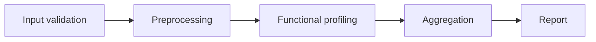

# FunOMIC2 Nextflow Pipeline

> [!success] 완료
> 기존 FunOMIC2 분석 절차를 Nextflow DSL2 기반으로 재구성했습니다.

| 항목 | 내용 |
| --- | --- |
| 기간 | 2026.03 ~ 2026.04 |
| 역할 | 기획 · 개발 · 실행 환경 구성 |
| 기술 | Nextflow DSL2, Python, Docker/Podman, Apptainer |
| 코드 | [e4m-hash/nf-core-funomic](https://github.com/e4m-hash/nf-core-funomic) |

## 문제

원본 FunOMIC2는 Shell script와 R script로 이어진 metagenomics 기능 분석
파이프라인입니다. 실행 순서와 의존성이 스크립트와 로컬 환경에 묶여 있어,
분석 단계를 재사용하거나 실패한 지점부터 다시 실행하기 어려웠습니다.

## 한 일

- 분석 단계를 Nextflow DSL2 process와 module로 분리
- 입력·출력 channel을 기준으로 단계 간 의존성을 명시
- 도구별 실행 환경을 컨테이너로 분리
- Nextflow cache와 `-resume`을 사용해 완료된 task 재사용
- 실행 설정과 분석 코드를 분리해 로컬·HPC profile 확장 지점 마련

## ML Engineering과 연결되는 부분

이 프로젝트에는 모델 학습이 없지만 ML 시스템 앞단에서 반복되는 문제를 다룹니다.

- 큰 파일을 sample 단위로 나누어 병렬 처리하기
- task별 CPU·memory·container 경계 정하기
- 실패한 실행을 처음부터 반복하지 않기
- pipeline version과 reference DB가 결과에 미치는 영향 기록하기

이 경험을 후속 ML 프로젝트의 feature 생성 pipeline과 데이터 lineage 설계에 적용합니다.

## 확인 가능한 근거

- 구현 코드: [nf-core-funomic](https://github.com/e4m-hash/nf-core-funomic)
- 원본 프로젝트: [ManichanhLab/FunOMIC2](https://github.com/ManichanhLab/FunOMIC2)
- Nextflow 학습 기록: [[nextflow]]

## 한계

- 처리 시간과 메모리 절감 효과를 같은 데이터에서 정량 비교하지 않았습니다.
- cloud executor별 실행 결과와 비용은 아직 측정하지 않았습니다.
- 현재 문서의 완료 표시는 파이프라인 재구현 범위를 뜻하며 운영 서비스 배포를 뜻하지 않습니다.
