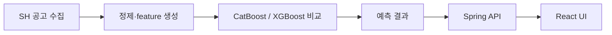

# KT Aivle Big Project

> [!success] 팀 프로젝트 완료
> SH 공공임대주택 정보와 과거 데이터를 수집해 예측 모델과 웹 애플리케이션을 연결했습니다.

| 항목 | 내용 |
| --- | --- |
| 기간 | 2025.02 ~ 2025.03 |
| 범위 | 데이터 수집 · ML 모델 비교 · 서비스 연동 |
| 기술 | Python, scikit-learn, XGBoost, CatBoost, PyTorch, Spring, React |

## 문제

공공임대주택 공고와 자격 정보가 여러 화면에 나뉘어 있고, 사용자가 현재 공고와
자신의 조건을 함께 비교하기 어렵다는 문제에서 시작했습니다. 팀은 공고 정보를
수집하고 과거 데이터로 예상 커트라인을 제시하는 웹 서비스를 만들었습니다.

## 데이터와 모델

- Selenium과 JSON parsing으로 최근 공고 정보 수집
- 위치, 면적, 방 개수, 경쟁률, 월세 등 tabular feature 구성
- CatBoost, XGBoost, RandomForest 계열 후보 비교
- 평면도 이미지를 입력으로 받는 별도 image-to-score 모델 실험
- Spring backend와 React frontend에서 공고·예측 결과 제공

## ML Engineering 관점에서 배운 점

- 모델 입력 schema와 웹 요청 schema를 맞추는 작업이 필요했습니다.
- 수집 페이지가 바뀌면 downstream feature도 깨질 수 있어 수집 검증이 중요했습니다.
- 모델 성능뿐 아니라 예측 결과를 사용자가 이해할 수 있는 형태로 전달해야 했습니다.

## 근거

- [ML 저장소](https://github.com/e4m98/Aivle_machine)
- [Spring 저장소](https://github.com/e4m98/AivleBigSpring)
- [React 저장소](https://github.com/e4m98/AivleBigReact)
- [과제 정의서 1](001-AI_19조_조별과제정의서-1.png)
- [과제 정의서 2](002-AI_19조_조별과제정의서-2.png)
- [과제 정의서 3](003-AI_19조_조별과제정의서-3.png)

## 한계

- 이 페이지는 팀 전체 구현 범위를 설명합니다. 개인 기여 범위는 저장소의 commit과 문서로 추가 정리할 예정입니다.
- 운영 환경의 latency, throughput, drift를 측정한 프로젝트는 아닙니다.
- 예측값은 의사결정을 보조하는 실험 결과이며 실제 당첨 가능성을 보장하지 않습니다.
